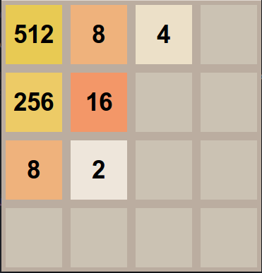

my2048
======
My own implementation of 2048 game. Clone the repository and play!

How to play
-----------

To start the game run:

    $ python 2048.py

Use <kbd>a</kbd>, <kbd>w</kbd>, <kbd>d</kbd>, <kbd>s</kbd> or <kbd>4</kbd>, <kbd>8</kbd>, <kbd>6</kbd>, <kbd>2</kbd> to move left, up, right and left

Screenshot
-----------

